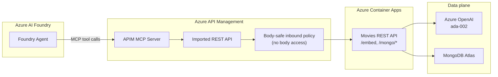

# 🎬 Movies API → APIM → MCP Gateway

Expose the Movies REST API (running on Azure Container Apps) as an **MCP server through Azure API Management**, so Azure AI Foundry agents (and any MCP client like GitHub Copilot or Claude Desktop) can call it as governed tools.

This follows the **"Bring Your Own AI Gateway"** pattern: instead of pointing Foundry directly at a raw MCP container, you put your existing REST API behind APIM and use APIM's native **Expose an API as an MCP Server** feature.

---

## 🧭 Architecture



**Why this pattern:** Any APIM policy that touches `context.Request.Body` / `context.Response.Body` enables response buffering that breaks the Server-Sent Events streaming MCP needs — `tools/list` times out and tool discovery fails. The policy in [policy.xml](policy.xml) deliberately never reads the body.

---

## 📁 Files

```
apim-mcp-gateway/
├── main.bicep            # Imports the Container App REST API into an existing APIM service
├── main.bicepparam       # Pre-filled parameters (APIM name, backend URL, route)
├── openapi-schema.json   # OpenAPI 3.0 spec describing all REST operations (becomes MCP tools)
├── policy.xml            # Body-safe inbound policy (critical for MCP streaming)
└── README.md             # This file
```

The REST operations that become MCP tools:

| Operation | Method + Path | MCP tool |
|-----------|---------------|----------|
| Generate embedding | `POST /embed` | `generateEmbedding` |
| Vector search | `POST /mongo/vector-search` | `mongoVectorSearch` |
| Structured find | `POST /mongo/find` | `mongoFind` |
| Aggregation | `POST /mongo/aggregate` | `mongoAggregate` |
| Health | `GET /health` | `healthCheck` |

---

## ✅ Prerequisites

| Requirement | Value |
|-------------|-------|
| Existing APIM service | `<APIM_SERVICE_NAME>` (RG `<APIM_RESOURCE_GROUP>`) |
| Container App backend (healthy) | `https://<CONTAINER_APP_FQDN>/api` |
| Azure CLI with Bicep | `az bicep version` |
| Permissions | API Management Service Contributor on the APIM resource |

> Fill in your values in [main.bicepparam](main.bicepparam) before deploying.

### Configuration values to gather

| Placeholder | Description | How to find it |
|-------------|-------------|----------------|
| `<SUBSCRIPTION_ID>` | Azure subscription GUID | `az account show --query id -o tsv` |
| `<APIM_SERVICE_NAME>` | Name of your existing APIM service | `az apim list --query "[].name" -o tsv` |
| `<APIM_RESOURCE_GROUP>` | Resource group of the APIM service | `az apim list --query "[].resourceGroup" -o tsv` |
| `<APIM_GATEWAY_HOST>` | APIM gateway hostname | `az apim show -g <APIM_RESOURCE_GROUP> -n <APIM_SERVICE_NAME> --query "gatewayUrl" -o tsv` |
| `<CONTAINER_APP_FQDN>` | Backend Container App ingress FQDN | `az containerapp show -g <CONTAINER_APP_RG> -n <CONTAINER_APP_NAME> --query "properties.configuration.ingress.fqdn" -o tsv` |
| `<API_PATH>` | Route prefix for the API in APIM (e.g. `movies`) | You choose this |

---

## 🚀 Deployment Steps

### Step 1 — Verify the backend is healthy

```powershell
curl.exe -i "https://<CONTAINER_APP_FQDN>/api/health"
```

You should get `200 OK` with a JSON body (`status: healthy`). If it times out, fix the Container App first (it must be running and reachable).

### Step 2 — Import the API into APIM (Bicep)

```powershell
az account set --subscription <SUBSCRIPTION_ID>

az deployment group create `
  --name movies-mcp-apim `
  --resource-group <APIM_RESOURCE_GROUP> `
  --template-file main.bicep `
  --parameters main.bicepparam
```

This creates an API named **`<API_ID>`** in APIM, served at:

```
https://<APIM_GATEWAY_HOST>/<API_PATH>
```

…and attaches the body-safe inbound policy.

### Step 3 — Verify the imported API

1. Azure Portal → **API Management** → `<APIM_SERVICE_NAME>`
2. **APIs** → **Movies MCP API** → confirm the 5 operations appear
3. (Optional) **Test** tab → run `POST /mongo/find` with body `{"collection":"movies","filter":{"year":1994},"limit":3}` → expect movie docs

### Step 4 — Expose the API as an MCP Server (portal)

1. In APIM, go to the **MCPs** section (left menu)
2. Click **Create MCP Server** → **Expose an API as an MCP Server**
3. Select **Movies MCP API**
4. For **API Operations**, select the tools you want exposed — at minimum:
   - `generateEmbedding`
   - `mongoVectorSearch`
   - `mongoFind`
   - `mongoAggregate`
5. Finish the wizard, then **copy the generated MCP Server URL** (looks like
   `https://<APIM_GATEWAY_HOST>/<MCP_PATH>`)

### Step 5 — Add the MCP tool to your Foundry agent

1. Open your agent in Azure AI Foundry → **Tools** → **Add** → **MCP**
2. **Server URL:** paste the MCP Server URL from Step 4
3. **Authentication:** `None` (or configure the JWT option from [policy.xml](policy.xml) if you enabled it)
4. Add the tools and **Save**

Test with:
- `Show me movies from 1994` → routes to `mongoFind`
- `Find movies about hope and redemption` → `generateEmbedding` then `mongoVectorSearch`
- `Top 10 highest rated sci-fi movies` → `mongoAggregate`

---

## 🔒 Optional — Enterprise governance (JWT + role-based access)

The inbound policy includes a commented `validate-azure-ad-token` block. To require Entra ID auth (matching the `foundry-integration` pattern):

1. Edit [policy.xml](policy.xml): uncomment the `<validate-azure-ad-token>` block and set `{{TENANT_ID}}` and `{{APIM_APP_CLIENT_ID}}`.
2. Redeploy Step 2.
3. In Foundry, set the MCP tool auth to use the project managed identity / JWT with the matching `audience`.

> Keep the policy **body-free** even when adding auth — token validation does not read the body, so MCP streaming stays intact.

---

## 🔥 Troubleshooting

| Symptom | Cause | Fix |
|---------|-------|-----|
| MCP `tools/list` times out / no tools discovered | A policy reads `context.Request.Body` or `Response.Body` | Use only the body-safe [policy.xml](policy.xml); remove any `set-body` / body inspection |
| `401` calling the API | `subscriptionRequired` true or JWT enabled without a token | Set `subscriptionRequired=false`, or supply a valid token |
| `404` from APIM | Wrong `apiPath` / backend `serviceUrl` | Confirm backend includes `/api`, and call `<gateway>/movies/...` |
| Backend 5xx | Container App down or Mongo/Atlas IP blocked | Verify `/api/health`; ensure Atlas Network Access allows the Container App egress IP |

---

## 📚 References

- [Expose REST APIs as MCP servers in Azure API Management](https://learn.microsoft.com/azure/api-management/export-rest-mcp-server)
- [About MCP servers in Azure API Management](https://learn.microsoft.com/azure/api-management/mcp-server-overview)
- [Connect an AI gateway to Foundry Agent Service](https://learn.microsoft.com/azure/foundry/agents/how-to/ai-gateway)
- Pattern reference: [microsoft/claims-processing-hack — challenge-4](https://github.com/microsoft/claims-processing-hack/tree/hack-nl/challenge-4)
